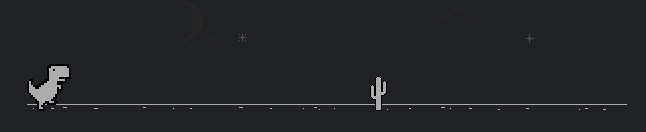

 

     👋 Hey there, I'm Felix. 👋    
     

## About me

- 💼 Data Engineer at 

- 📈 Striving to become an all-round generalist!

- 🌱 I’m currently learning Cloud Computing, UI&UX design, Front-end stuff, System design and more!

- ❤️ Previous experience in software development, web & app development, product design, graphic design, project management, game development (Unity) and more!

- 📝 Visit my blog at: [Ikigai](https://felix-ku.github.io/)

## Languages and Tools:

<code></code>

|  |  |
| ------------- | ------------- |

## Connect with me

[][website]
[][linkedin]

[website]: https://felix-ku.github.io/
[linkedin]: https://www.linkedin.com/in/felixku/

